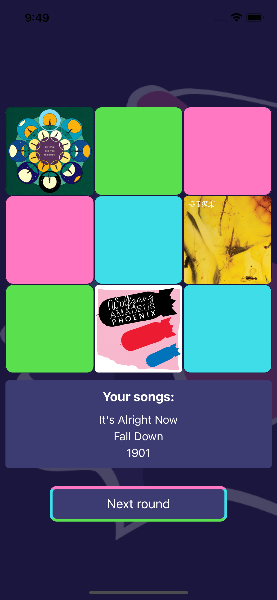

# Groove Game

## Links
- Back-end repository: https://github.com/AKWGH/groove-game-be
---
## Background

This is the front-end to the Groove Games project. The app integrates with the Spotify API to provide users with a seamless experience of building a personalized playlist while playing their favorite games.

---

## Built With

- React Native
<br/>
---

## Getting Started

To view this project locally please follow these simple steps.

### Prerequisites

1. Install node and/or ensure you are running version v16.18.1 or higher:
```
node -v
```

2. Install npm and/or ensure you are running version 8.19.2 or higher:
```
//install npm
npm install -g npm

//check the version you're running
npm -v
```

3. Fork this respository on GitHub

4. Clone the forked repository to your chosen local directory
```
git clone https://github.com/your_username_/groove-game-fe
```

5. Install dependencies by running
```
npm install
```

6. Install Expo to be able preview the app on your machine. You may also install the Expo Go app on your mobile device.

<br/>

https://docs.expo.dev/get-started/installation/

Suggested mobile simulators: XCode (iOS) and Android Studio.

<br />

7. Preview the app through this command: 
```
npm start
```
When prompted in the terminal choose to view it through a simulator or scan the QR code to view on your mobile device.

---
## App Wireframes and Preview
These are some some app previews alongside their respective wireframes.
### Home Screen


<br />

### Dancefloor Screen



<br/>

### Playlist Result


---

## Further information

### Useful Links
- https://reactnative.dev/
- https://reactnavigation.org/
- https://icons.expo.fyi/
- https://www.npmjs.com/
- https://callstack.github.io/react-native-paper/
- https://docs.expo.dev/get-started/installation/

